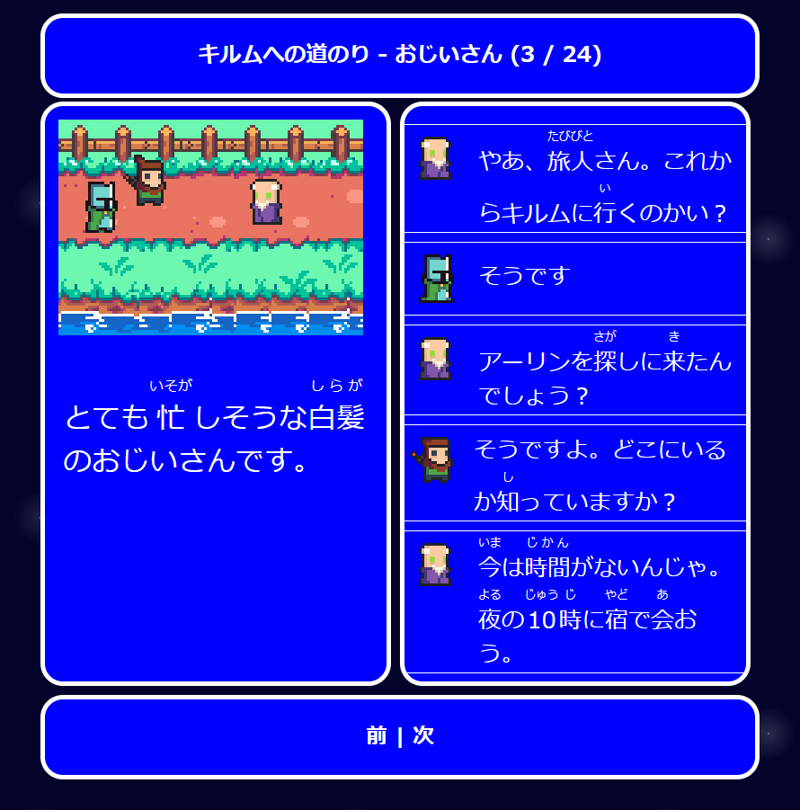

# DrDru.github.io

I publish two projects on this site.

[ DrDru's Main Experiment ]( https://drdru.github.io/intro )  : that's my initial project. It is an attempt to teach Japanese in Japanese by creating enjoyable comprehensible input that allow you to start reading from day 1 ( a la Lingua Latina Per Se Illustrata ).

[ The Tile World Chronicles ]( https://drdru.github.io/twc ) : a set of stories in a Final Fantasy inspired universe in N4+ Japanese

This project was started in 2019 if I remember well. I think of it as a 10 year long project. 

Since a picture is aworth a thousand words : 

DrDru's Main Experiment

The Tile World Chronicles

To go to the homepage  https://drdru.github.io/
